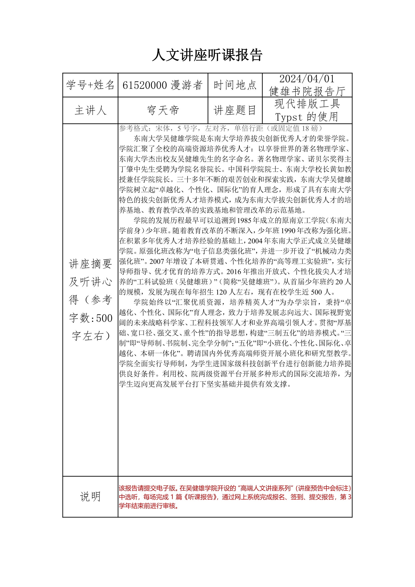

# 东南大学吴健雄学院人文讲座听课报告模板（Typst）

## 环境

Typst 0.11.1

需要系统字体支持（应该不成问题吧）。

## 使用方法

考虑到其性质，本模板没有发布到官方渠道。

下载 `lib.typ` 和 `main.typ`，修改 `main.typ` 内容，填写讲座相关信息和报告正文。
主文件 `show` 语句后所有内容都会出现在表格正文部分。

```typ
// 修改讲座相关信息
#show: lec-report.with(
  stu-id: "61520000",
  stu-name: "漫游者",
  time: "2024/04/01",
  loc: "健雄书院报告厅",
  speaker: "穹天帝",
  subject: "现代排版工具Typst的使用",
)

// 后面均为报告正文
```

## 效果图


